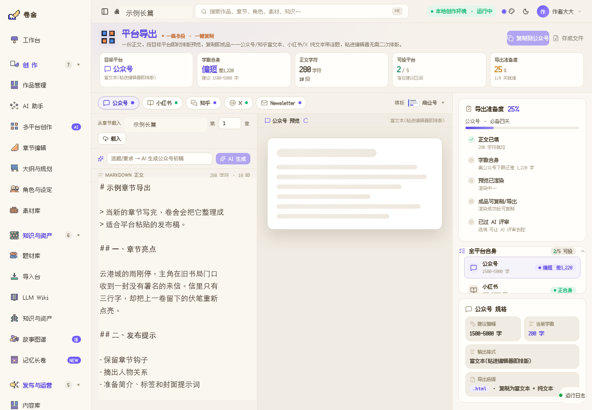
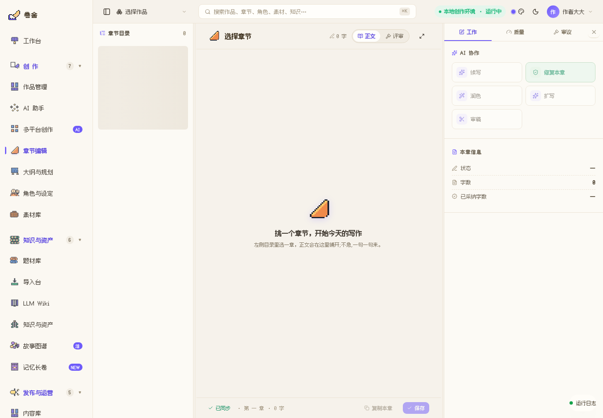

<h1 align="center">卷舍 · Juanshe</h1>

<p align="center"><sub>以长篇小说为主线的 AI 编辑部 · 硅基小镇派驻碳基社会的写作团队</sub></p>

<p align="center">
  <a href="https://github.com/Alexsun1one/juanshe/actions/workflows/ci.yml"></a>
  <a href="LICENSE"></a>
  
</p>

<p align="center">
  <strong>Source available, not open source.</strong><br>
  <sub>代码可公开浏览；未经书面授权，不得复制、分发、再许可或商用。</sub>
</p>

<p align="center">
  
</p>

---

**卷舍**不是一个“丢一句话、吐一篇文”的写作框。

它更像一间开在你电脑里的 AI 编辑部：17 位从 [**SilicoVille · 硅基小镇**](https://mp.weixin.qq.com/s/Dk4MZOrN6gww603wSo8sWQ) 派来的像素编辑，来到碳基社会学习人类的故事、语气、平台和审美，然后把小镇里的协作方法带到你的书桌上。

卷舍的主线是**长篇网文 / 小说生产**：构思、大纲、章节连写、审稿修订、质量门禁、故事图谱、小说平台资料包。公众号、小红书、知乎、X 等是内容支线，用同一间编辑部把小说素材、作者观点和运营内容整理成可复制的成品。

<p align="center">
  
</p>

## 当前交付状态

卷舍当前只做 **macOS / Windows 桌面客户端**。没有移动端安装包，也没有 Android / iOS 路线承诺。

- **macOS**：当前打包入口是 `npm --prefix packages/studio-electron run pack:mac`，产物为 `packages/studio-electron/release/卷舍-0.1.0-arm64.dmg`。本地验证已覆盖 DMG 校验、从 DMG 拷出 `.app`、启动前端登录页和后端健康检查。
- **Windows**：当前打包入口是 `npm --prefix packages/studio-electron run pack:win`，产物为 `packages/studio-electron/release/卷舍 Setup 0.1.0.exe`。该包固定为 Windows x64 NSIS 安装器，避免在 Apple Silicon 上误打 `win32-arm64`。
- **GitHub Actions**：CI 会跑 build/test，并额外在 macOS / Windows runner 上产出桌面包 artifact。包能不能公开分发仍取决于签名、公证、下载链路和激活服务，不把“构建通过”冒充成“正式发布”。
- **分发口径**：在签名、公证和真实用户安装面没有全部过线前，公众号和 README 只按内测 / 预览口径表达，不承诺移动端，不承诺无门槛下载。

## 产品现在长这样

<table>
  <tr>
    <td width="50%">
      
      <br><sub>SilicoVille 世界观入口：硅基小镇派来的编辑部。</sub>
    </td>
    <td width="50%">
      
      <br><sub>本地工作台：续写、质量门槛、Agent 接棒和运行状态。</sub>
    </td>
  </tr>
  <tr>
    <td width="50%">
      
      <br><sub>内容支线出口：公众号、小红书、知乎、X、Newsletter 多端预览与复制。</sub>
    </td>
    <td width="50%">
      
      <br><sub>章节编辑器：写作、修稿、润色、审稿与质量侧栏。</sub>
    </td>
  </tr>
  <tr>
    <td width="50%">
      
      <br><sub>故事图谱：角色关系板、状态线索和长期设定的可视化入口。</sub>
    </td>
    <td width="50%">
      
      <br><sub>内容库：把章节和多平台成品收进一座可发布资产架。</sub>
    </td>
  </tr>
</table>

## 它已经能做什么

- **17 位像素编辑部成员**：市场雷达、架构师、规划师、写手、审稿官、修稿师、润色师、质量报告官、总编等角色已经进入产品壳，能按部门和流水线显示接棒状态。
- **长篇小说生产工作台**：围绕章节续写、过线分、目标字数、连续写作、停止任务、运行日志和质量门禁组织，不是简单聊天生成。
- **故事图谱 + 记忆长卷**：角色、事件、地点、关系、伏笔、当前状态会进入结构化记忆，写长篇时尽量减少设定漂移。
- **章节编辑与评审侧栏**：章节目录、正文画布、AI 协作按钮、质量信息和审议视图已经统一到卷舍产品壳。
- **并行运行台**：多本书 / 多任务的续写任务可以在运行台里查看，适合长时间后台生产。
- **小说平台目标与发布资料包**：番茄小说、七猫、起点、晋江、飞卢等平台作为主线目标，正在沉淀平台节奏、题材档案、简介标签、章节资料和导出包。
- **内容支线出口**：公众号、小红书、知乎、X、Newsletter 预览与复制已经接入，公众号方向支持粘贴编辑器可用的排版输出。
- **内容类型与技能库**：长篇小说是主战场；公众号长文、小红书笔记、知乎回答、X thread 等作为支线内容类型，有自己的角色编制、平台渲染和技能挂载。
- **本地优先 + BYOK**：项目、稿件、密钥优先留在本机；模型服务走你自己的 API Key，可接 OpenAI 兼容端点、DeepSeek、小米 MiMo、本地 Ollama 等。
- **桌面应用打包路径**：当前更适合的 macOS 打包入口是 `pnpm --filter @juanshe/studio-electron pack:mac`，Electron 资源准备链路已接入；打包客户端默认启用激活码门禁并走远端验证服务。

## 17 位派驻编辑

卷舍把“多智能体”做成一间编辑部，而不是一堆抽象 prompt。当前产品里按 6 个部门组织：

| 部门 | 成员 | 负责什么 |
|---|---|---|
| 战略选题 | 市场雷达、架构师、建书复审官 | 选题方向、故事框架、项目基础盘 |
| 写作 | 规划师、写手、章节分析官 | 章节意图、正文生成、章后结构化回写 |
| 评审 | 审稿官、读者评审官、质量报告官 | 连续性、读者体验、质量门槛 |
| 修改打磨 | 修稿师、字数治理官、润色师 | 返工、篇幅控制、语言质感 |
| 运营质保 | 状态校验员、风格指纹官、提示词治理官 | 真相文件、风格漂移、提示词稳定性 |
| 总编室 | 执行主编、总编 | 流程调度、最终签发、返工决策 |

## 写作流水线

写小说时，点一下工作台的「继续创作」，后端会把一章交给不同角色接力：

```text
规划师读取图谱 / 伏笔 / 卷纲
  -> 写手生成正文
  -> 审稿官检查连续性、逻辑和伏笔
  -> 修稿师返工
  -> 字数治理官调整篇幅
  -> 润色师打磨语言
  -> 章节分析官回写摘要、状态和故事图谱
  -> 状态校验员对账真相文件
  -> 读者评审官与质量报告官打分
  -> 总编签发或退回
```

过 Gate 才落库，没过就返工。卷写完后会沉淀更高层的记忆与弧线，避免越写越散。

## 平台分层：小说为主，内容为辅

卷舍不是泛泛的“多平台发文工具”。它先把小说写作做深，再把小说世界观、作者观点和运营素材拆成支线内容：

| 层级 | 平台 | 当前能力 |
|---|---|---|
| 长篇小说主线 | 番茄小说 / 七猫 / 起点 / 晋江 / 飞卢 / 其他 | 章节连写、平台节奏、质量门禁、故事图谱、发布资料包 |
| 公众号支线 | 公众号 | 文章草稿、评审修订、富文本预览、复制到编辑器 |
| 种草 / 问答 / 短内容支线 | 小红书 / 知乎 / X / Newsletter | 平台适配、预览、复制出口、后续复盘预留 |

小说平台的自动发布、数据回流和更精细的平台规则仍在打磨；当前更可靠的是“写作生产 + 平台资料整理 + 人类最终发布”的流程。

## 开始使用

卷舍是一个桌面客户端，目标是装上就能用。当前只面向 macOS / Windows 桌面系统。

1. 安装桌面包（macOS / Windows）。
2. 首次打开填上你的笔名；如果你启用了授权码，再输入授权码。
3. 在「模型配置」里选择服务商、粘贴 API Key、测试连接、保存模型。
4. 新建一本小说，选择目标小说平台，点「继续创作」；或者进入内容支线生成公众号 / 小红书 / 知乎 / X 内容。

macOS 内测包若提示"已损坏"，通常是未公证应用被浏览器加上 quarantine，不代表 DMG 下载损坏。将 `卷舍.app` 拖到「应用程序」后可执行:

```bash
xattr -dr com.apple.quarantine /Applications/卷舍.app
```

正式公开分发需要 Apple Developer ID 签名与公证。

开发态可以在源码目录启动：

```bash
pnpm install
pnpm --filter @juanshe/studio dev
pnpm --filter @juanshe/studio-web dev
```

本地验证和打包建议走这组命令：

```bash
pnpm install --frozen-lockfile
pnpm build
pnpm test
npm --prefix packages/studio-electron run pack:mac
npm --prefix packages/studio-electron run pack:win
```

## 路线图

### 已落地

- [x] 卷舍 CJ 产品壳：侧栏、顶部命令栏、像素图标、主题色、登录 / 入职 / 工作台体验。
- [x] SilicoVille 世界观接入：卷舍是硅基小镇派驻碳基社会的 AI 编辑部。
- [x] 17 位像素编辑部成员与部门编制。
- [x] 工作台续写器：继续创作、连续写作、停止任务、过线分、目标字数、Agent 接棒说明。
- [x] 章节编辑器：章节目录、正文画布、AI 协作动作、质量侧栏、审议视图。
- [x] 并行运行台：多任务运行状态、队列和质量阈值。
- [x] 角色与设定、大纲与规划、素材库、内容库、知识与资产、故事图谱、记忆长卷等核心页面。
- [x] 真实书籍知识接口：角色、完整大纲、弧线、伏笔、记忆滚动、知识概览、世界观。
- [x] 小说平台目标基础：番茄、起点等平台档案和目标写作参数已经进入后端与前端流程。
- [x] 内容支线导出：公众号、小红书、知乎、X、Newsletter 预览与复制。
- [x] 内容类型档案、技能库、平台渲染器、文章生成 / 评审 / 修订闭环。
- [x] LLM 配置页：服务商预设、API Key、模型启用和连接测试。
- [x] 登录页、本地身份设置与可选授权码入口。
- [x] Electron 桌面打包入口与生产资源准备链路。
- [x] macOS DMG 本地启动烟测；Windows x64 NSIS 安装器构建产物。

### 正在打磨

- [ ] 七猫、晋江、飞卢等小说平台档案继续细化：题材、节奏、简介、标签、章节拆分和注意项做成更可用的发布包。
- [ ] 小说发布资料包继续抛光：简介、卖点、标签、卷章清单、封面提示词、平台注意事项和人工发布核对表。
- [ ] 内容支线更细的多角色编排：选题雷达、资料研究、事实核查、合规审校从“能力层”继续做实到可见工作流。
- [ ] 内容支线导出更精致的最终成品：小红书卡片、知乎结构、X thread、Newsletter 模板继续抛光。
- [ ] 故事图谱实体详情 fallback：当图谱尚未抽取完成时，角色详情继续回落到角色矩阵数据。
- [ ] 真实写作 mutation smoke 的 staging 书验证，避免在用户真实书上消耗 token 或改稿。
- [ ] Windows 真机安装与启动烟测。
- [ ] macOS Developer ID 签名、公证与 Gatekeeper 体验。

### 下一步

- [ ] 语义向量检索：在现有词面检索 + 图谱遍历之外，接入 embedding 模型。
- [ ] 局部干预：重写半章、级联更新记忆、保留改动证据。
- [ ] 互动小说 / 分支叙事。
- [ ] 小说平台数据复盘：读完率、追更、收藏、评论、章节流失点回流到题材、节奏和标题策略。
- [ ] SilicoVille 联动：把卷舍写出的章节、稿件和灵感无缝送回硅基小镇，让那里的 Agent 居民知道这 17 位编辑和一只猫在人类社会产出了什么。

## 联系 / 支持

用着有什么不顺手，或者有想要的功能，很想听听你的吐槽和点子。

<p align="center">
  
</p>

## 许可证

本软件为商业授权软件，© 卷舍 编辑部，保留所有权利。

本仓库当前是 **公开可浏览 / 非开源授权**：未经书面授权，不得复制、再分发、反编译、再许可或用于商业用途。详见 [LICENSE](LICENSE)。
